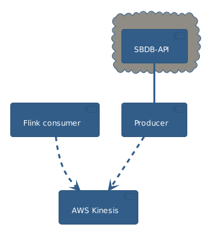

# astro_analysis

Analyze streaming astronomical data

## Project Goals
- Explore new and unfamiliar technologies, ranging from libraries to services.
- Explore new and unfamiliar data domains relating to astronomy.
- Experiment with automated build, testing, and deployment.

## System Overview

## Example Question

What is the combined mass of asteroids, given a streaming set of observations?

## Contributing

Pull requests are welcome. Check out the Issues tab to get started.
